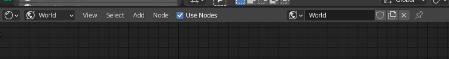

# video_friendly_video_cropper
 Blender Addon that allows a user friendly way of cropping videos with render border

# Why
Video cropping doesn't have to be hard. But it is anyway.

This addon aims to provide a slightly easier way to just crop videos and as a bonus, create aPNGs out of them.

# How
Have an empty scene with just a camera  
  
Open a shader graph editor  
  
Switch its mode to World  
  
create a node setup like this,  
a tex coordinate (Window) go to Image Texture, going into Background or Emission going into World Output  
  
load your video in the image tex node

To preview the video in 3D view, switch to Rendered view, works for Cycles and Eevee
If your background is a checkerboard, Go to Render Properties > Film > Disable TransparentZ

To remove repetition outside of the camera view, go to Camera Settings > Viewport Display > Passerpartout = 1.0
  

To crop the video, draw a render border inside of camera view (Ctrl + B in object mode)

This addon uses the camera's render border to crop the video  
You can preview/export the crop in Properties > Output > Video Cropper Panel  
You can change/enable the settings, but not all settings are supported for previewing, only for exporting.  
* Colors Limit

Sometimes when using start/end seconds, the video will appear blocky in the preview.  
This usually doesn't appear in the exported video
